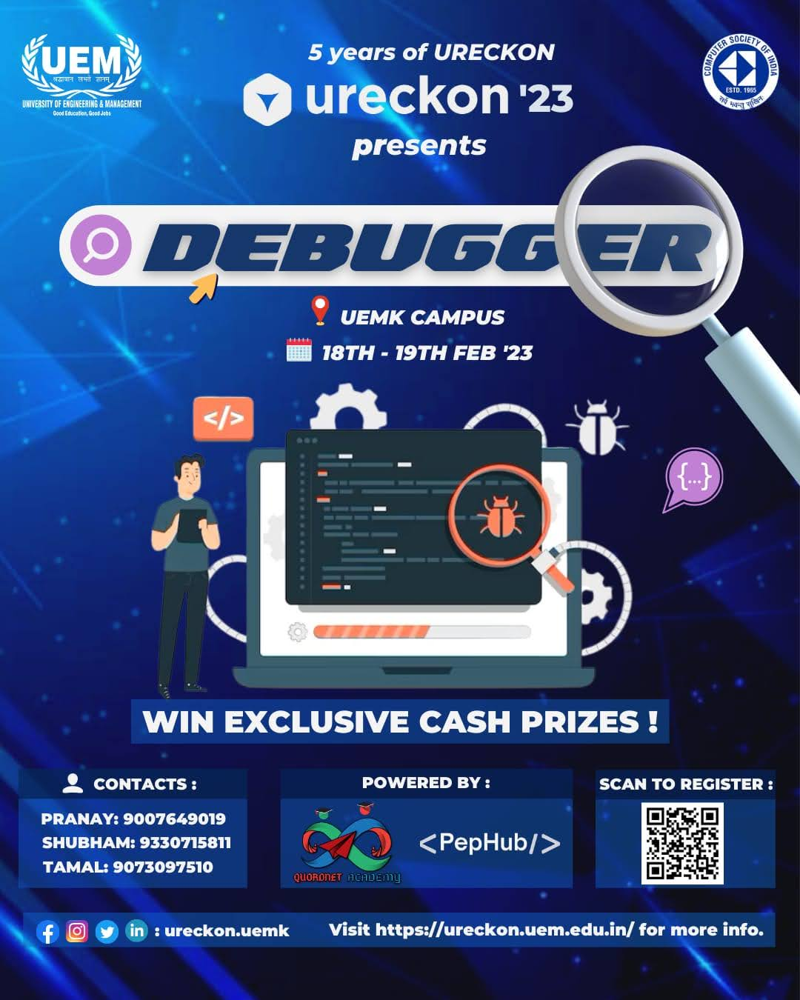

# [DEBUGGER](https://ureckon.uem.edu.in/event/coding/debugger) Contest by [Ureckon](https://ureckon.uem.edu.in/)

## Introduction

-   This repository is for the budding juniors of my University.
-   It contians tips and tricks to get a good score in Debugger.

## Concepts to grasp before participating

These are the following concepts which be tested in the Contest

1. Variable Scopes - Global, Local
2. Slicing in Java and Python.
3. Problems on List and String manipulation.
4. List, Sets, Dictionary Comprehensions.
5. Lambda Functions and annonymous functions
6. Bitwise Operations involving (^, !, <<, >>, ~)
7. Operator preceedence and associativity rules.
8. Pointers - Adresess, Pass by value, Pass by reference, Memory Management.
9. Function closures in JS, self Invoking functions.
10. Concepts of Object Oriented Programming in all programming languages.
11. Inheritence (Multiple, Multi-Level, Hybrid, Heirarchial), Runtime-Compile Time Polymorphism in Java
12. Runtime and Compile Time errors in Java.
13. JavaScipt Object and its manipulation in different contexts.
14. String Buffers, String Builders, Arrays, ArrayLists, HashMaps, HashSets in Java
15. Static and Non-Static keywords and their uses in different contexts in Java.
16. Pointer and Address operators like '&' and '\*' and their uses in different contexts in C.
17. Structures and Unions in C
18. In depth concept of Regular expressions in any one programming language.
19. Inner Functions Python and Inner Classes in Java and Python
20. Abstract Classes, Interfaces, Generaic Classes.
21. Access Modifiers and their scopes in Java.
22. Explore and Learn what your browser console is capable of doing.

## Tips to get a good rank:

-   Problems are MCQ Based, but contains negative marking, so guessing solutions going to critically damage overall accuracy.
-   Codes are comparatvely easy in prelims but time is very limited. But the problems in finals will definitely burn your CPU.
-   Try to solve less problems, but only choose the option if you are definite about the solution.
-   As there is negative marking too, so its better to leave some difficult problems unsolved and focus on the solvable ones.
-   Your main target must not be solving more problems, but to solve most of them correctly, this will increase your accuracy.
-   Approach problems randomly, and not in sequnce. If you are unable to solve first few problems, start solving from the end.
-   Take a look at the problems in the given repository. They are not from the contest, but they will clear your concepts.
-   Take the help of Browser console for evaluating Bitwise Expressions.
